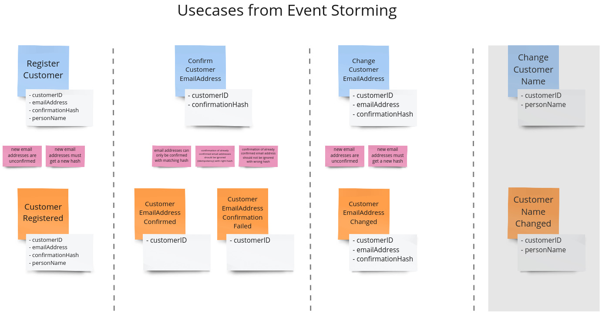

## Repository for code sharing between participants of the workshop "Implementing an Event-Sourced Aggregate"

## The Lifecycle of an Event-Sourced Aggregate

## Our Aggregate Example
In this workshop, we want to focus on a Customer aggregate supporting four simple use cases. The details, which you can
find below, could have been collected in an *Event Storming* workshop beforehand:

## Test Scenarios

### Register Customer
Command: **RegisterCustomer** with properties
* customerID (ID)
* emailAddress (EmailAddress)
* confirmationHash (Hash)
* name (PersonName)

Event: **CustomerRegistered** with properties
* customerID (ID)
* emailAddress (EmailAddress)
* confirmationHash (Hash)
* name (PersonName)

**Rules & Policies**:
* new email addresses are unconfirmed
* new email addresses must get a new hash

### Confirm Email Address
Command: **ConfirmCustomerEmailAddress** with properties
* customerID (ID)

Event: **CustomerEmailAddressConfirmed** or **CustomerEmailAddressConfirmationFailed**, both with property
* customerID (ID)

**Rules & Policies**:
* email addresses can only be confirmed with matching hash
* confirmation of already confirmed email addresses should be ignored (idempotency) with right hash
* confirmation of already confirmed email address should not be ignored with wrong hash

### Change Email Address
Command: **ChangeCustomerEmailAddress** with properties
* customerID (ID)
* emailAddress (EmailAddress)
* confirmationHash (Hash)

Event: **CustomerEmailAddressChanged** with properties
* customerID (ID)
* emailAddress (EmailAddress)
* confirmationHash (Hash)

**Rules & Policies**:
* new email addresses are unconfirmed
* new email addresses must get a new hash

### Change Name
Command: **ChangeCustomerName** with properties
* customerID (ID)
* name (PersonName)

Event: **CustomerNameChanged** with properties
* customerID (ID)
* name (PersonName)
